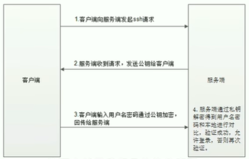

# Hadoop

[TOC]

## 0. 前提知识

### 0.1 SSH协议

SSH（Secure Shell），网络安全协议，eg: Linux用户加密实现远程登录，服务器之间免密登录

非对称加密，需要一对密钥，公开密钥（公钥），私有密钥（私钥）；公钥对数据加密，只有用对应私钥才能解密 



ssh-keygen的过程，生成了id_rsa.pub存储公钥，同时还生成了id_rsa文件存储私钥，保存在本机的。ssh远程登录的过程，先是客户端请求远程主机，远程主机根据authorized_keys中本机公钥的内容加密一个请求，返回给客户端，客户端然后利用私钥对这个请求解密，再发送给远程主机，远程主机收到了准确的应答，即认为是该客户端是可信的，因此允许登录。


### 0.2 Linux

打包：`tar -cvf  XXX.tar`

解包：`tar -xvf  XXX.tar`

压缩打包：`tar -zcvf  XXX.tar.gz`

解包解压：`tar -zxvf  XXX.tar.gz   -C  XXXpathXXX`

加`-C`，来指定路径

`free -h` 显示内存的使用情况

`ps -ef | grep 进程名`   或 `ps -ef`查看运行的进程

`kill -9 进程号` 结束进程

`ifconfig`：检测网络配置

`scp -r 文件名 远程用户名@远程域名:远程路径`：远程拷贝

## 1. Hadoop 导论

### 1.1 Hadoop的概述

Hadoop，分布式系统基础架构，主要解决海量**数据存储**与**分析计算**，广义常指Hadoop生态圈

**分布式**：**多台机器**部署**不同的组件**

**集群**：**多态机器**部署**相同的组件**

分布式存储，分布式计算

**优势：**

高可靠性：底层维护多个**数据副本**

高扩展性：在集群间分配任务，方便**动态扩展/删除节点**

高效性：在MapReduce下，**并行工作**

高容错性：自动重分配失败的任务

### 1.2 Hadoop的组成（MapReduce，Yarn，HDFS）

物理层面：Yarn集群，HDFS集群，两者逻辑上分离，物理上一起，两者均为主从架构


- **HDFS（Hadoop Distributed File System，分布式文件系统）架构**
  
    NameNode（nn）：存储文件元数据，以及块列表和块所在的DataNode等
    
    DtaNode（dn）：本地文件系统存储文件块数据
    
    Seconary NameNode（snn）：每隔一段时间对NameNode元数据备份
    
    
    
- **YARN （Hadoop的资源管理器）架构**
  
    ResourcesManager（RM）：整个集群的老大
    
    NodeManger（NM）：单个节点的老大
    
    
    
- **MapReduce架构**
  
    
    

### 1.3 大数据技术生态体系


## 2. HDFS

### 2.1 HDFS概述

HDFS (Hadoop Distrubuted File System)，Hadoop分布式文件系统，**master/slave主从架构，NameNode作为主节点，DataNode作为从节点**


- 特点：
1. **无限多机横向扩展**，支持海量数据存储
2. 元数据记录功能，**快速定位**文件位置
    1. NameNode管理的元数据：文件自身的属性信息：文件名、权限、大小，文件块的位置映射信息：文件块和DataNode的映
    2. DataNode负责文件的各个block的存储管理
3. 文件物理上分块存储在不同机器上（block size默认128M），针对**块并行操作提高效率**（上传下载），
4. 数据备份（默认1+2副本），冗余存储，保证**数据安全**
5. NameNode负责namespace,层次型文件组织结构，客户端提供统一的抽象目录树

- NameNode：通过**内存**和**磁盘文件**两种方式管理元数据，仅**存储HDFS的元数据，访问HDFS的唯一入口，单点故障**


- DataNode：配置**大量硬盘空间**，负责数据块block的存储，启动时向NameNode注册并汇报块列表，关闭某个DataNode不影响数据可用性（调用其他副本）

- SecondartNameNode：辅助NameNode，但不能替代NameNode

### 2.2 HDFS写数据流程


1. HDFS客户端创建`DistrubutedFlieSystem`，调用`create()`方法，通过RPC请求NameNode创建文件，NameNode检查判断（目录是否存在，权限是否足够等）。检查通过，NameNode记下记录并返回`FSDataOutputStream`对象给客户端用于写数据
2. 客户端通过`FSDataOutputStream`写数据（将数据分成一个个数据包packet，默认64K），内部组件`DataStreamer`请求NameNode挑选合适的存储数据
3. 副本的DataNode
4. 传输反方向通过ACK校验数据包是否传输成功，客户端写完数据后，FSDataOutputStream调用`close()`关闭，`DistrubutedFlieSystem`告知NameNode文件写入完成，NameNode等待最小复制块（默认1，若有副本传输失败，可通过已有副本重新传输）完成即可返回

**核心概念**：

1. Pipeline管道：客户端将数据块写入第一个数据节点，第一数据节点保存数据后复制到第二个数据节点，后者保存后将其复制到第三个数据节点（充分利用宽带，最小化推送数据延时）
   
    
    
1. ACK应答响应：pipeline传输数据过程中，传输反方向进行ACK校验，确保数据传输安全
   
    
    
1. 默认3副本存储策略：
    1. 第一副本：优先客户端本地，否则随机；
    2. 第二副本：不同于第一副本的不同机架；
    3. 第三副本：第二副本的相同机架不同机器；
    
    
    

### 2.3 HDFS shell命令

`hadoop fs 命令`

```bash
hadoop fs -ls file:///              # 本地Linux文件系统
hadoop fs -ls hdfs://node1:8020/   # 操作HDFS分布式文件系统
hadoop fs -ls /                     # 根目录，根据设置参数决定，默认NameNode根目录
```

```bash
hadoop fs -mkdir [-p] <path>
# -p 若父目录不存在，自动创建

hadoop fs -ls [-h] [-R] [<path>]
# path 指定目录路径
# -h 人性化显示文件size
# -R 递归查看指定目录及其子目录

# upload to HDFS
hadoop fs -put [-f] <localsrc> <dst>
# -f 覆盖已存在文件
# localsrc 本地文件， dst HDFS目录

# download to local
hadoop fs -get [-f] <src> <localdst>

# copy
hadoop fs -cp [-f] <src> <dst>

# 追加，将指定的本地文件追加到dst文件中 
hadoop fs -appendToFile <localsrc> <dst>

# 查看
hadoop fs -cat <src>
```

## 3. MapReduce

### 3.1 MapReduce组成

MapReduce组成包括三类：`MRAppMaster`，`MapTask`，`ReduceTask`；

程序只能包含一个Map和一个Reduce阶段，或只有Map阶段；

数据都以键值对形式流转；

### 3.2 MapReduce运行流程


**Map阶段：**

1. 对输入目录下对文件进行**逻辑切片**（默认128M），**每个切片由一个MapTask处理**
2. 切片中的数据默认**按行读取**，解析**<key， value>**（key为每一行的起始位置偏移量，value是本行的文本内容），每读取解析一个<key, value>调用一次**map方法处理数据**
3. 根据不同ReduceTask分区，Map输出数据写入**内存缓冲区**，达到比例**溢出spill到磁盘**（溢出时默认根据key排序）
4. **merge合并**所有溢出文件成一个文件


**Reduce阶段：**

1. ReduceTask主动复制拉取所需数据
2. 将拉取的数据全部**合并merge**，并**排序**
3. 对排序后的键值对调用reduce方法（相同的键值调用一次reduce方法），输出写到HDFS文件

Shuffle：从Map输出到Reduc取得数据的过程称为shuffle，**频繁涉及内存、磁盘间数据往复**


特点：

1. 易于编程，提供接口
2. 良好的扩展性，可通过增加机器扩展计算能力
3. 高容错性，任何单一机器宕机了，可将计算任务转移
4. 适合海量数据离线处理

局限：

1. 实时计算性能差
2. 不能流式计算（数据不能动态变化）

## 4. YARN

### 4.1 YARN组成

YARN（Yet Another Resource Negotiator, 另一种资源协调者），是一种**通用资源管理系统和调度平台（不仅支持MR程序，还支持各种计算机程序）**


物理层面组成：

1. ResourceManager(RM)：YARN主角色，管理各个机器资源分配
2. NodeManager(NM)：管理本机器资源分配

APP层面：

1. ApplicationMaster(AM)：每个应用程序包含一个AM，负责程序资源申请、监督 (eg. MRAppMaster)

### 4.2YARN运行流程


**YARN运行阶段：**

1. 客户端向YARN中RM提交应用程序（比如MR程序）
2. RM为程序**分配Container**，并要求对应NM在这个Container**启动该程序的AM**
3. AM向RM注册并保持通信，**申请资源**，要求对应NM启动任务
4. **NM设置运行环境，启动任务**
5. 任务通过RPC协议**向AM汇报状态与进度**，运行完成后，AM向RM注销并关闭自己

### 4.3 调度策略

- FIFO Scheduler
  
    先进先出
    


- Capacity Scheduler
  
    多个队列，每个队列内部FIFO
    


优点：

1. 层次化管理，合理资源分配与限制
2. 保证每个队列都不会占用整个集群资源
3. 安全，用户只能向自己队列提交任务，不能修改其他队列任务
4. 弹性分配，空闲资源可分配给任何队列

- Fair Scheduler
  
    获得相等的资源
    


优点：

1. 保证最小配额，允许资源共享（其他队列没有任务执行，可使用其他队列）

## 5. Hive

### 5.1 Hive概述

**联机事务处理系统（OLTP）**：前台接收用户数据可立即传送到后台处理（eg.关系型数据库 MySQL，Oracle），读压力大，没必要在OLTP环境展开分析

**联机分析处理系统（OLAP）**：用于存储、分析、报告的数据系统，面向分析的集成化数据环境（eg.数据仓库）

ETL：extract，transform，load

**数仓特点：**

1. 面向主题性（抽象层次对数据完整、一致的描述）
2. 集成（统一不同数据源数据进行分析）
3. 非易失、非异变性（主要分析读取，少修改删除）
4. 时变性（数据仓库数据随时间更新）

Hive是在Hadoop之上的开源**数据仓库**系统，可将Hadoop中**结构化、半结构化数据文件映射成一张数据库表**，提供HQL查询语言，能**将HQL转换为MapReduce程序**


**Hive组件**

Metastore负责管理Hive中所有表的元数据信息，包括表的结构、存储格式、列的类型，权限、存储分区等，Metastore后端依赖其他关系型数据库，例如MySQL


### 5.2 Hive SQL —— DDL

数据定义语言（**Data definition Language, DDL**），对database，table进行创建，删除，修改等操作（CREATE, ALTER, DROP），**DDL不涉及表内部的数据操作**

```sql
# 显示所有数据库
show databases;
show schemas;
# 显示数据库中的表格
show tables;
show tables in database_name;
# 显示表格的元数据信息
desc formatted table_name;

# 转到指定数据库
use data_name;

# 创建数据库
create database  if not exists database_name;

# 创建表：字段顺序与文件一致
create table t_archer(
	id int comment "ID number",
	name string comment "hero name",
	hp_max int comment "max hp",
	mp_max int comment "max mp",
	attack_max int comment "max attack",
	defense_max int comment "max defense",
	attack_range string comment "attack range",
	role_main string comment "role main",
	role_assist string comment "role assist"
	)
row format delimited       -- 行格式分割
fields terminated by "\t"; -- 字段终止符，默认'\001'

create table t_team_ace_player(
	id int,
	team_name string,
	ace_player_name string
);

create table if not exists table_name comment "XXXXX" as 
select XXXX from XXXX
```

### 5.3 Hive SQL —— DML

```sql
# 本地加载数据 本质是hadoop fs -put 上传操作
load data local inpath '/root/hivedata/students.txt' into table student_local;
# 从HDFS加载数据 本质上是hadoop fs -mv 移动操作
load data inpath 'student.txt' into table student_hdfs;
```

```sql
# 将指定数据插入到表中，常配合select操作（涉及MapReduce操作较慢）
insert into table table_name values(A, B, C);
insert into table table_name select XXX from XXXX;

select
from
where
group by
having
order by
limit
```

```sql
# Hive 内置函数
show functions;
describe function extended count;

# String function
length(str)
reverse(str)
concat(str1, str2)
# 带分隔字符连接字符串
concat_ws(separator, [string | array(string)])
concat_ws(',', 'www', array('google', 'com'))
# 截取子字符串, pos从1开始，负数倒数
substr(str, pos[, len])
substring(str, pos[, len])

# Date function
current_date()  # 获取当前日期
unix_timestamp() # 获取当前时间戳
unix_timestamp('20111207 13:01:03', 'yyyyMMdd HH:mm:ss')   # 将指定格式的date转换为时间戳
from_unixtime(123456, 'YYYY-MM-dd HH:mm:ss')   # 将时间戳转换为指定格式date

datediff('2013-12-08', '2012-05-09')   # 计算日期差
date_add('2012-02-28', 10)    # 添加天数
date_sub('2012-01-01', 10)    # 减去天数

# Mathematical function
round(3.1415926)  # 四舍五入
round(3.1415926, 4)   # 保留特定位数
rand(3)    # 随机数，指定随机种子

# Condition function
select if (sex='男', 'M', 'F') from student
select 
	case sex 
		when '男' then 'male'
		when '女' then 'female' 
		else 'other' 
	end 
from student

nvl(sex, 'other')   # 填空值
```