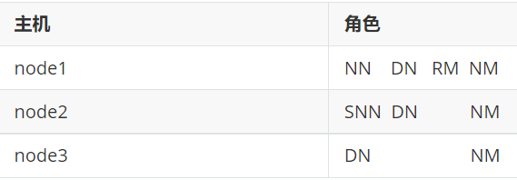

# MOMO User Analysis

## 1. 介绍

通过3台CentOS 7 虚拟机模拟Hadoop环境，部署Hadoop，Hive。其中Hive通过MySQL作为Metastore的后端数据库。通过DataGrip的远程连接的方式对进行数据的ETL，最后使用TabLeau对数据进行简单的可视化分析。


## 附录A. Hadoop的部署

### 1.  配置IP地址与网关&导入虚拟机



- 修改VMware的IP与网关
  
    
    
- 修改Windows网络适配器的IP与网关


- 在VMware虚拟机配置局域网，导入3台CentOS虚拟机，虚线部分为虚拟机部分


- Windows设置host映射：`C:\Windows\System32\drivers\etc`
  
    
    
- Linux服务器设置host映射 `vim /etc/hosts`
  
    
    

### 2. XShell 连接虚拟机&配置基本环境

- Xshell新建会话
  
    
    
    
    
- SSH免密登录（只需配置node1到node1、node2、node3）
  
    ```bash
    #node1生成公钥私钥 (一路回车)
    ssh-keygen
    
    #node1配置免密登录到node1 node2 node3
    ssh-copy-id node1
    ssh-copy-id node2
    ssh-copy-id node3
    ```
    
- 集群同步时间 `ntpdate [ntp5.aliyun.com](http://ntp5.aliyun.com/)`

- 关闭服务器防火墙：
  
    ```bash
    firewall-cmd --state	#查看防火墙状态
    systemctl stop firewalld.service  #停止firewalld服务
    systemctl disable firewalld.service  #开机禁用firewalld服务
    ```
    
- 创建文件夹`export/data, export/sever, export/software`

- 安装配置JDK 1.8  /export/server
  
    ```
    #解压安装包
    tar zxvf jdk-8u65-linux-x64.tar.gz
    
    #配置环境变量
    vim /etc/profile
    
    export JAVA_HOME=/export/server/jdk1.8.0_241
    export PATH=$PATH:$JAVA_HOME/bin
    export CLASSPATH=.:$JAVA_HOME/lib/dt.jar:$JAVA_HOME/lib/tools.jar
    
    source /etc/profile
    
    #验证是否安装成功
    java -version
    
    ```
    
- 上传Hadoop安装包到node1 /export/server
  
    ```bash
    hadoop-3.3.0-Centos7-64-with-snappy.tar.gz
    
    tar zxvf hadoop-3.3.0-Centos7-64-with-snappy.tar.gz
    ```
    
- 修改配置文件(配置文件路径 hadoop-3.3.0/etc/hadoop)
    - [hadoop-env.sh](http://hadoop-env.sh/)
      
        ```
        #文件最后添加
        export JAVA_HOME=/export/server/jdk1.8.0_241
        
        export HDFS_NAMENODE_USER=root
        export HDFS_DATANODE_USER=root
        export HDFS_SECONDARYNAMENODE_USER=root
        export YARN_RESOURCEMANAGER_USER=root
        export YARN_NODEMANAGER_USER=root
        
        ```
        
    - core-site.xml
      
        ```html
        <!-- 设置默认使用的文件系统 Hadoop支持file、HDFS、GFS、ali|Amazon云等文件系统 -->
        <property>
            <name>fs.defaultFS</name>
            <value>hdfs://node1:8020</value>
        </property>
        
        <!-- 设置Hadoop本地保存数据路径 -->
        <property>
            <name>hadoop.tmp.dir</name>
            <value>/export/data/hadoop-3.3.0</value>
        </property>
        
        <!-- 设置HDFS web UI用户身份 -->
        <property>
            <name>hadoop.http.staticuser.user</name>
            <value>root</value>
        </property>
        
        <!-- 整合hive 用户代理设置 -->
        <property>
            <name>hadoop.proxyuser.root.hosts</name>
            <value>*</value>
        </property>
        
        <property>
            <name>hadoop.proxyuser.root.groups</name>
            <value>*</value>
        </property>
        
        <!-- 文件系统垃圾桶保存时间 -->
        <property>
            <name>fs.trash.interval</name>
            <value>1440</value>
        </property>
        
        ```
        
    - hdfs-site.xml
      
        ```html
        <!-- 设置SNN进程运行机器位置信息 -->
        <property>
            <name>dfs.namenode.secondary.http-address</name>
            <value>node2:9868</value>
        </property>
        
        ```
        
    - mapred-site.xml
      
        ```html
        <!-- 设置MR程序默认运行模式： yarn集群模式 local本地模式 -->
        <property>
          <name>mapreduce.framework.name</name>
          <value>yarn</value>
        </property>
        
        <!-- MR程序历史服务地址 -->
        <property>
          <name>mapreduce.jobhistory.address</name>
          <value>node1:10020</value>
        </property>
        
        <!-- MR程序历史服务器web端地址 -->
        <property>
          <name>mapreduce.jobhistory.webapp.address</name>
          <value>node1:19888</value>
        </property>
        
        <property>
          <name>yarn.app.mapreduce.am.env</name>
          <value>HADOOP_MAPRED_HOME=${HADOOP_HOME}</value>
        </property>
        
        <property>
          <name>mapreduce.map.env</name>
          <value>HADOOP_MAPRED_HOME=${HADOOP_HOME}</value>
        </property>
        
        <property>
          <name>mapreduce.reduce.env</name>
          <value>HADOOP_MAPRED_HOME=${HADOOP_HOME}</value>
        </property>
        
        ```
        
    - yarn-site.xml
      
        ```html
        <!-- 设置YARN集群主角色运行机器位置 -->
        <property>
        	<name>yarn.resourcemanager.hostname</name>
        	<value>node1</value>
        </property>
        
        <property>
            <name>yarn.nodemanager.aux-services</name>
            <value>mapreduce_shuffle</value>
        </property>
        
        <!-- 是否将对容器实施物理内存限制 -->
        <property>
            <name>yarn.nodemanager.pmem-check-enabled</name>
            <value>false</value>
        </property>
        
        <!-- 是否将对容器实施虚拟内存限制。 -->
        <property>
            <name>yarn.nodemanager.vmem-check-enabled</name>
            <value>false</value>
        </property>
        
        <!-- 开启日志聚集 -->
        <property>
          <name>yarn.log-aggregation-enable</name>
          <value>true</value>
        </property>
        
        <!-- 设置yarn历史服务器地址 -->
        <property>
            <name>yarn.log.server.url</name>
            <value><http://node1:19888/jobhistory/logs></value>
        </property>
        
        <!-- 历史日志保存的时间 7天 -->
        <property>
          <name>yarn.log-aggregation.retain-seconds</name>
          <value>604800</value>
        </property>
        
        ```
        
    - workers
      
        ```
        node1.itcast.cn
        node2.itcast.cn
        node3.itcast.cn
        ```
        

- 分发同步hadoop安装包
  
    ```bash
    cd /export/server
    
    scp -r hadoop-3.3.0 root@node2:$PWD
    scp -r hadoop-3.3.0 root@node3:$PWD
    
    ```
    
- 将hadoop添加到环境变量（3台机器）
  
    ```bash
    vim /etc/profile
    
    export HADOOP_HOME=/export/server/hadoop-3.3.0
    export PATH=$PATH:$HADOOP_HOME/bin:$HADOOP_HOME/sbin
    
    source /etc/profile
    
    #scp给其他两台机器
    ```
    
- Hadoop集群启动
    - （==首次启动==）格式化namenode
      
        ```
        hdfs namenode -format
        ```
        
    - 脚本一键启动
      
        ```bash
        # 单独启动HDFS集群
        start-dfs.sh
        # 单独启动YARN集群
        start-yarn.sh
        # 启动Hadoop集群（包含上面两个）
        start-all.sh
        ```
        
    - Web UI页面
        - HDFS集群：[http://node1:9870/](http://node1:9870/)
        - YARN集群：[http://node1:8088/](http://node1:8088/)
        

## 附件B. Hive部署

### **Mysql安装**

- 卸载Centos7自带的mariadb
  
    ```bash
    [root@node3 ~]# rpm -qa|grep mariadb
    mariadb-libs-5.5.64-1.el7.x86_64
    
    [root@node3 ~]# rpm -e mariadb-libs-5.5.64-1.el7.x86_64 --nodeps
    [root@node3 ~]# rpm -qa|grep mariadb
    [root@node3 ~]#
    ```
    
- 安装mysql
  
    ```bash
    mkdir /export/software/mysql
    
    #上传mysql-5.7.29-1.el7.x86_64.rpm-bundle.tar 到上述文件夹下  解压
    tar xvf mysql-5.7.29-1.el7.x86_64.rpm-bundle.tar
    
    #执行安装
    yum -y install libaio
    
    [root@node3 mysql]# rpm -ivh mysql-community-common-5.7.29-1.el7.x86_64.rpm mysql-community-libs-5.7.29-1.el7.x86_64.rpm mysql-community-client-5.7.29-1.el7.x86_64.rpm mysql-community-server-5.7.29-1.el7.x86_64.rpm
    
    warning: mysql-community-common-5.7.29-1.el7.x86_64.rpm: Header V3 DSA/SHA1 Signature, key ID 5072e1f5: NOKEY
    Preparing...                          ################################# [100%]
    Updating / installing...
       1:mysql-community-common-5.7.29-1.e################################# [ 25%]
       2:mysql-community-libs-5.7.29-1.el7################################# [ 50%]
       3:mysql-community-client-5.7.29-1.e################################# [ 75%]
       4:mysql-community-server-5.7.29-1.e################                  ( 49%)
    ```
    
- mysql初始化设置
  
    ```bash
    #初始化
    mysqld --initialize
    
    #更改所属组
    chown mysql:mysql /var/lib/mysql -R
    
    #启动mysql
    systemctl start mysqld.service
    
    #查看生成的临时root密码
    cat  /var/log/mysqld.log
    
    [Note] A temporary password is generated for root@localhost: o+TU+KDOm004
    ```
    
- 修改root密码 授权远程访问 设置开机自启动
  
    ```bash
    [root@node2 ~]# mysql -u root -p
    Enter password:     #这里输入在日志中生成的临时密码
    Welcome to the MySQL monitor.  Commands end with ; or \g.
    Your MySQL connection id is 3
    Server version: 5.7.29
    
    Copyright (c) 2000, 2020, Oracle and/or its affiliates. All rights reserved.
    
    Oracle is a registered trademark of Oracle Corporation and/or its
    affiliates. Other names may be trademarks of their respective
    owners.
    
    Type 'help;' or '\h' for help. Type '\c' to clear the current input statement.
    
    mysql>
    
    #更新root密码  设置为hadoop
    mysql> alter user user() identified by "hadoop";
    Query OK, 0 rows affected (0.00 sec)
    
    #授权
    mysql> use mysql;
    
    mysql> GRANT ALL PRIVILEGES ON *.* TO 'root'@'%' IDENTIFIED BY 'hadoop' WITH GRANT OPTION;
    
    mysql> FLUSH PRIVILEGES;
    
    #mysql的启动和关闭 状态查看 （这几个命令必须记住）
    systemctl stop mysqld
    systemctl status mysqld
    systemctl start mysqld
    
    #建议设置为开机自启动服务
    [root@node2 ~]# systemctl enable  mysqld
    Created symlink from /etc/systemd/system/multi-user.target.wants/mysqld.service to /usr/lib/systemd/system/mysqld.service.
    
    #查看是否已经设置自启动成功
    [root@node2 ~]# systemctl list-unit-files | grep mysqld
    mysqld.service                                enabled
    ```
    
- Centos7 干净卸载mysql 5.7
  
    ```bash
    #关闭mysql服务
    systemctl stop mysqld.service
    
    #查找安装mysql的rpm包
    [root@node3 ~]# rpm -qa | grep -i mysql
    mysql-community-libs-5.7.29-1.el7.x86_64
    mysql-community-common-5.7.29-1.el7.x86_64
    mysql-community-client-5.7.29-1.el7.x86_64
    mysql-community-server-5.7.29-1.el7.x86_64
    
    #卸载
    [root@node3 ~]# yum remove mysql-community-libs-5.7.29-1.el7.x86_64 mysql-community-common-5.7.29-1.el7.x86_64 mysql-community-client-5.7.29-1.el7.x86_64 mysql-community-server-5.7.29-1.el7.x86_64
    
    #查看是否卸载干净
    rpm -qa | grep -i mysql
    
    #查找mysql相关目录 删除
    [root@node1 ~]# find / -name mysql
    /var/lib/mysql
    /var/lib/mysql/mysql
    /usr/share/mysql
    
    [root@node1 ~]# rm -rf /var/lib/mysql
    [root@node1 ~]# rm -rf /var/lib/mysql/mysql
    [root@node1 ~]# rm -rf /usr/share/mysql
    
    #删除默认配置 日志
    rm -rf /etc/my.cnf
    rm -rf /var/log/mysqld.log
    ```
    

---

### **Hive的安装（安装一台）**

- 上传安装包 解压
  
    ```
    tar zxvf apache-hive-3.1.2-bin.tar.gz
    ```
    
- 解决Hive与Hadoop之间guava版本差异
  
    ```bash
    cd /export/server/apache-hive-3.1.2-bin/
    rm -rf lib/guava-19.0.jar
    cp /export/server/hadoop-3.3.0/share/hadoop/common/lib/guava-27.0-jre.jar ./lib/
    ```
    
- 修改配置文件
    - hive-env.sh
      
        ```bash
        cd /export/server/apache-hive-3.1.2-bin/conf
        mv hive-env.sh.template hive-env.sh
        
        vim hive-env.sh
        export HADOOP_HOME=/export/server/hadoop-3.3.0
        export HIVE_CONF_DIR=/export/server/apache-hive-3.1.2-bin/conf
        export HIVE_AUX_JARS_PATH=/export/server/apache-hive-3.1.2-bin/lib
        ```
        
    - hive-site.xml
      
        ```
        vim hive-site.xml
        ```
        
        ```xml
        <configuration>
        <!-- 存储元数据mysql相关配置 -->
        <property>
            <name>javax.jdo.option.ConnectionURL</name>
            <value>jdbc:mysql://node1:3306/hive3?createDatabaseIfNotExist=true&amp;useSSL=false&amp;useUnicode=true&amp;characterEncoding=UTF-8</value>
        </property>
        
        <property>
            <name>javax.jdo.option.ConnectionDriverName</name>
            <value>com.mysql.jdbc.Driver</value>
        </property>
        
        <property>
            <name>javax.jdo.option.ConnectionUserName</name>
            <value>root</value>
        </property>
        
        <property>
            <name>javax.jdo.option.ConnectionPassword</name>
            <value>hadoop</value>
        </property>
        
        <!-- H2S运行绑定host -->
        <property>
            <name>hive.server2.thrift.bind.host</name>
            <value>node1</value>
        </property>
        
        <!-- 远程模式部署metastore metastore地址 -->
        <property>
            <name>hive.metastore.uris</name>
            <value>thrift://node1:9083</value>
        </property>
        
        <!-- 关闭元数据存储授权  -->
        <property>
            <name>hive.metastore.event.db.notification.api.auth</name>
            <value>false</value>
        </property>
        </configuration>
        
        ```
    
- 上传mysql jdbc驱动到hive安装包lib下
  
    ```
    mysql-connector-java-5.1.32.jar
    ```
    
- 初始化元数据
  
    ```bash
    cd /export/server/apache-hive-3.1.2-bin/
    
    bin/schematool -initSchema -dbType mysql -verbos
    #初始化成功会在mysql中创建74张表
    ```
    
- 在hdfs创建hive存储目录（如存在则不用操作）
  
    ```bash
    hadoop fs -mkdir /tmp
    hadoop fs -mkdir -p /user/hive/warehouse
    hadoop fs -chmod g+w /tmp
    hadoop fs -chmod g+w /user/hive/warehouse
    ```
    
- ==启动hive==
- 1、启动metastore服务
  
    ```bash
    #前台启动  关闭ctrl+c
    /export/server/apache-hive-3.1.2-bin/bin/hive --service metastore
    
    #前台启动开启debug日志
    /export/server/apache-hive-3.1.2-bin/bin/hive --service metastore --hiveconf hive.root.logger=DEBUG,console
    
    #后台启动 进程挂起  关闭使用jps+ kill -9
    nohup /export/server/apache-hive-3.1.2-bin/bin/hive --service metastore &
    ```
    
- 2、启动hiveserver2服务
  
    ```bash
      nohup /export/server/apache-hive-3.1.2-bin/bin/hive --service hiveserver2 &
    
      #注意 启动hiveserver2需要一定的时间  不要启动之后立即beeline连接 可能连接不上
    ```
    
- 3、beeline客户端连接
  
    ```
    /export/server/apache-hive-3.1.2-bin/bin/beeline
    
    beeline> ! connect jdbc:hive2://node1:10000
    beeline> root
    beeline> 直接回车
    ```